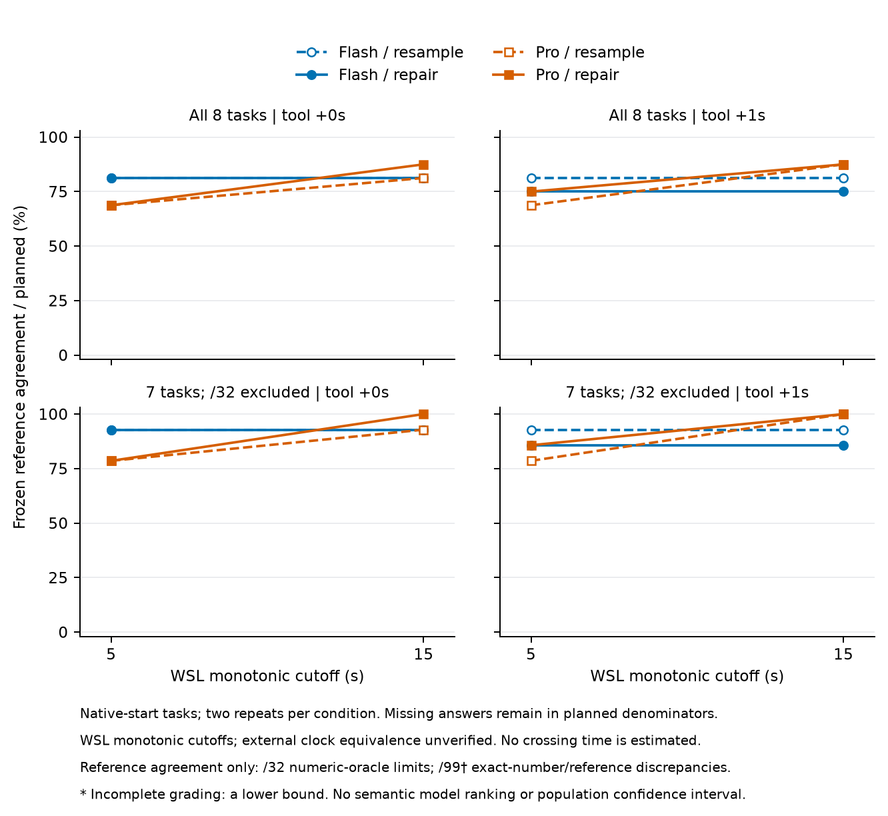
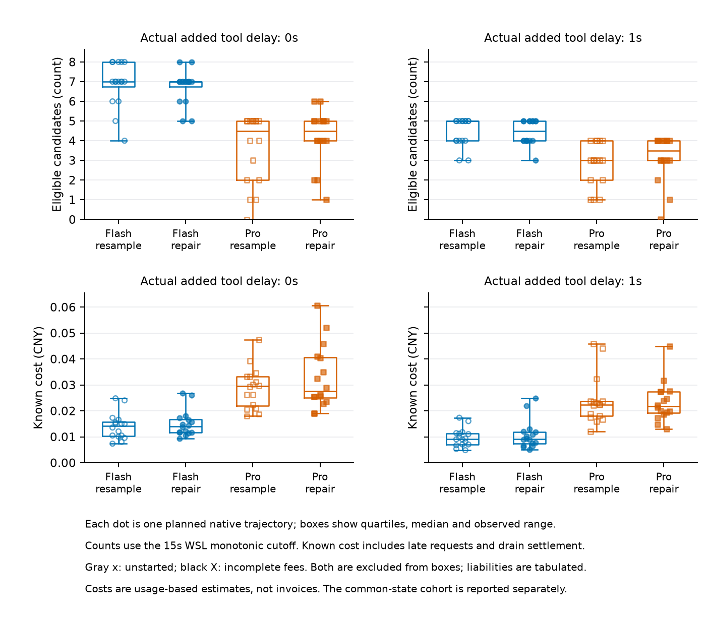
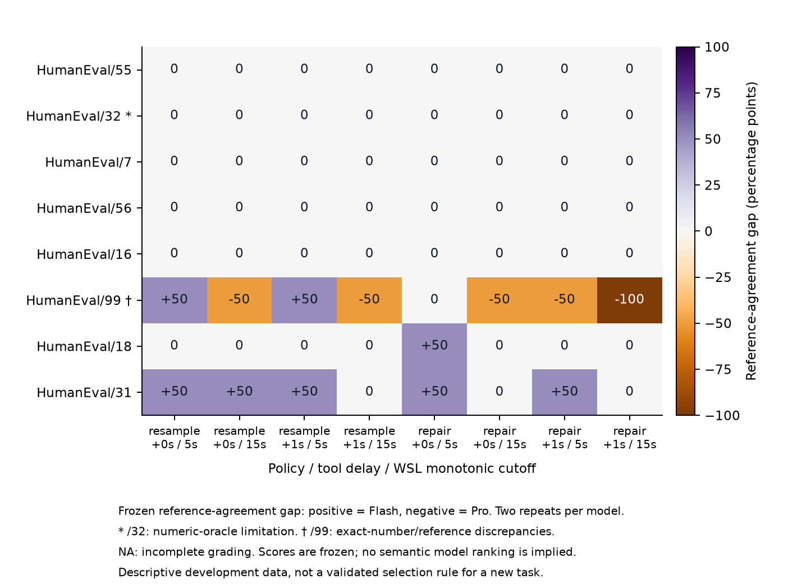

# R3 共同截止时间开发实验：结果与解释边界

日期：2026-10-06。真实在线批次已完成 **144/144 条轨迹、843 次已知费用请求**，进程退出码为 0 且已回收；独立离线隐藏评分完成 **715/715 个候选身份**，未评分身份为 0。这里的 715 个候选身份与下文 HumanEval/99 每个候选的 715 个测试用例是不同分母。

在当前冻结判定器下，原生任务的 Flash 通过数在 5/15 秒均为 51/64，Pro 从 45/64 增至 55/64。但这**尚未证明“小模型靠更多迭代胜出”**：Flash 没有相对可交付首稿的隐藏通过增益；Pro 的增益全部来自首稿不可交付的轨迹；排除 /32 后，15 秒的 5 个 Pro 独有通过配对又全部涉及 /99 的参考答案语义争议。另有外部时钟与单调时钟差异，见下文。

## 实验和读表口径

执行前冻结的[协议](coding-deadline.md)包含原生矩阵 128 条：8 题（55、32、7、56、16、99、18、31）× 两个 literal API 模型 × 两种策略（独立重采样 `resample`、读取上一轮公开反馈的 `repair`）× 公开工具额外延迟 0/1 秒 × 两次重复。另有同一个 Flash 来源错误状态的 16 条条件续跑，单列为 common。每条轨迹产生 5/15 秒两个相关快照，总计 288 个；短截止点不提前结束生成，不能当成独立运行两种计算预算。

候选需在记录的单调时钟截止点前完成公开检查、资源清理、指定延迟及选择所需记录，才有资格入选。选择公开通过数最高的候选，平分保留最早可用者；隐藏结果仅在全部在线资源关闭后评分。本文的“通过”均指冻结隐藏判定器的通过，不能不加限定地解释为程序语义完全正确。没有候选（`no_candidate`）是该截止点未能交付可用程序，仍保留在计划分母中；它不同于已交付程序的隐藏失败，也不同于未评分。本批快照无未启动或未评分项，所有轨迹均 complete，无 guard 截尾。

## 原生矩阵：交付、首稿与最终选择

下表按预定的策略、延迟与重复等权合并；细分条件保留在 [conditions.csv](../../research/results/coding-deadline/conditions.csv)。首稿基线固定为 **attempt-01 在同一截止点可交付的结果**，不能用后续第一份成功程序替代。失败/超时列只计已选候选的隐藏结果。

| 任务范围 | 模型 | 截止点 | 选中程序通过 / 计划数 | 隐藏失败 / 超时 | 无候选 | 首稿通过数 | 净增加通过数 |
|---|---|---:|---:|---:|---:|---:|---:|
| 全 8 题 | Flash | 5 | 51/64（79.69%） | 12 / 1 | 0 | 51 | 0 |
| 全 8 题 | Pro | 5 | 45/64（70.31%） | 0 / 0 | 19 | 44 | +1 |
| 全 8 题 | Flash | 15 | 51/64（79.69%） | 12 / 1 | 0 | 51 | 0 |
| 全 8 题 | Pro | 15 | 55/64（85.94%） | 7 / 0 | 2 | 46 | +9 |
| 预先规定排除 /32 | Flash | 5 | 51/56（91.07%） | 5 / 0 | 0 | 51 | 0 |
| 预先规定排除 /32 | Pro | 5 | 45/56（80.36%） | 0 / 0 | 11 | 44 | +1 |
| 预先规定排除 /32 | Flash | 15 | 51/56（91.07%） | 5 / 0 | 0 | 51 | 0 |
| 预先规定排除 /32 | Pro | 15 | 55/56（98.21%） | 0 / 0 | 1 | 46 | +9 |

Pro 在 5 秒的 +1 和 15 秒的 +9 均是 `baseline no_candidate → selected pass`；没有原生轨迹表现为“截止前可交付首稿隐藏失败，最终选择隐藏通过”。按策略拆分，5 秒的 +1 来自 resample；15 秒的 +9 中 resample 为 +6、repair 为 +3。这是本批描述性计数，不据此主张策略因果优势。两个截止点的增益不能相加为独立样本。Flash 在 5 秒已全部有可用候选，Pro 的无候选数随截止点放宽明显下降，因此必须把首稿交付速度、格式恢复与代码修复分开。当前分数的两点排序发生变化，但不能据此拟合一个精确交叉时刻。

排除 /32 后，各条件的通过数如下，每格分母为 14。这些小样本点用于描述；不凭这些差值宣称 repair 的普遍因果收益。

| 策略 / 额外工具延迟 | Flash：5 → 15 | Pro：5 → 15 |
|---|---:|---:|
| repair / 0 秒 | 13 → 13 | 11 → 14 |
| repair / 1 秒 | 12 → 12 | 12 → 14 |
| resample / 0 秒 | 13 → 13 | 11 → 13 |
| resample / 1 秒 | 13 → 13 | 11 → 14 |

预先规定的原生首轮“公开或格式失败”分层含 13 条、5 个任务组，排除 /32 后为 10 条、4 个任务组，成员未知数为 0。实际组成是 **12 次格式解析失败及 1 次公开检查超时**，均来自 Pro；Flash 在该分层没有成员。达到至少 3 题的预定最低支持门槛，不等于已经证明跨题反馈效应，更不能把这些事件全部写成自然代码错误。原生 128 次首轮中其余 115 次均公开通过，公开测试的天花板效应很强。

## Common：一个已知公开错误状态的条件续跑

所有 common 轨迹从同一个历史 Flash 候选作为选择器后备开始；仅 repair 看到该候选与公开诊断，resample 看不到。该状态在公开测试中为 3/4，例如公开例子 `-14.5` 应输出 `-15`，实际输出 `-14`。状态依据公开失败选定，未用隐藏结果筛选；它不是 16 个独立任务，也不与原生矩阵合并。

| 模型 | 截止点 | 选中程序隐藏通过 / 计划数 | 无候选 | 新 attempt-01 通过数 | 相对新首稿净增益 |
|---|---:|---:|---:|---:|---:|
| Flash | 5 | 1/8 | 0 | 1 | 0 |
| Flash | 15 | 1/8 | 0 | 1 | 0 |
| Pro | 5 | 4/8 | 0 | 3 | +1 |
| Pro | 15 | 8/8 | 0 | 3 | +5 |

16/16 条均曾提高后备程序的公开得分，未改善比例为 0/16（观察 16，未知 0）。这并不意味着 16 条都解决了隐藏语义问题。Common repair 的第一轮已收到种子反馈，因此不属于“反馈前首稿失败”分层。其模型差异同样受下面的 /99 判定器问题限制。

## 每次迭代究竟改变了什么

以下只展示已结束开发数据中的身份、时间和诊断计数，不公开代码或隐藏输入。时间是相对 task-ready 的记录单调时钟秒数，四舍五入至三位小数；隐藏栏是事后结果，在线选择器看不到。

**原生例：`native-046-he99-deepseek-flash-resample-delay1-rep1`。** 公开平分使两个截止点都保留 attempt-01，即便后面出现当前隐藏判定器的全过候选。

| 候选 | 可用时刻 | 公开通过 | 冻结隐藏结果 | 是否改变选择 |
|---|---:|---:|---|---|
| attempt-01 | 2.697 | 4/4 | fail，700/715 | 是，首次选择 |
| attempt-02 | 5.519 | 4/4 | fail，700/715 | 否，平分 |
| attempt-03 | 8.586 | 4/4 | fail，700/715 | 否，平分 |
| attempt-04 | 11.596 | 4/4 | pass，715/715 | 否，平分 |
| attempt-05 | 14.652 | 4/4 | fail，700/715 | 否，平分 |
| attempt-06 | 无 | 未运行 | 晚到 HTTP，仅计费，无候选 | 否 |

attempt-01 代码 SHA256 前缀为 `2e1662f3ed12`，attempt-04 为 `3c1e51fe416e`；完整哈希见 [attempts.csv](../../research/results/coding-deadline/attempts.csv)。在当前 oracle 口径下，类似“最终保留失败、后来有 eligible 全过候选”的情况有原生 1 条、common 3 条。它们说明公开平分规则的行为，不证明这些后续程序语义更好，更不能把事后隐藏 oracle 当成可用的在线策略。

**条件修复例：`common-130-he99-deepseek-flash-repair-delay0-rep1`。** 历史种子隐藏结果为 692/715。第一轮修复了负数半值方向错误，公开分数上升；之后重复产生同一代码。

| 候选 | 可用时刻 | 公开通过 | 冻结隐藏结果 | 是否改变选择 |
|---|---:|---:|---|---|
| 历史种子 | 初始后备 | 3/4 | fail，692/715 | 初始状态 |
| attempt-01 | 2.001 | 4/4 | fail，700/715 | 是，替换种子 |
| attempt-02 | 3.985 | 4/4 | fail，700/715 | 否 |
| attempt-03 | 5.901 | 4/4 | fail，700/715 | 否 |
| attempt-04 | 8.118 | 4/4 | fail，700/715 | 否 |
| attempt-05 | 10.049 | 4/4 | fail，700/715 | 否 |
| attempt-06 | 12.063 | 4/4 | fail，700/715 | 否 |
| attempt-07 | 14.352 | 4/4 | fail，700/715 | 否 |
| attempt-08 | 无 | 未运行 | 晚到 HTTP，仅计费，无候选 | 否 |

种子代码 SHA256 前缀 `04e08559ca23`，attempt-01 至 07 均为 `d075cede7313`。种子到第一轮是独立的状态转移，不与原生首稿混计。公开全过后继续执行是预先冻结的协议；“最终所选候选出现后的费用”不自动等于部署时可避免的浪费。

## /99 与 /32：分数不能直接当作能力标签

排除 /32 后，原生选中程序的 5 条隐藏失败均是 /99 的 Flash 程序；15 秒配对的 5 个 Pro 独有通过也全部在 /99。对代表候选和已保存工作进程输出做离线核对发现：参考实现先转为二进制 `float`，而题面没有明示这种转换或数值大小上限。

按“输入有限十进制字符串的精确数值，取最近整数，正负半值均远离零”的显式语义，独立的 **Fraction 加整数商余数**核验确认了 15 个分歧点：参考输出 15 个均不符合该精确语义；代表候选 `native-041-…/attempt-01` 有 11 个正确整数输出、4 个 `CandidateException`。四个异常仍是真实候选缺陷，不能称该程序整体正确；异常原件也不足以单独证明具体 Python 异常类型。另一个当前 oracle 全过的 `native-046-…/attempt-04` 在这 15 点均与参考一致，因而均不符合该精确语义。

这项审计**只核验 15 个分歧输入及其原件绑定，没有对全部 715 个 /99 用例或全体候选重新判定语义正确性**。原有 700/715、715/715 等分数全部保留，描述为对冻结参考的符合程度。不能把这 5 个 Pro 独有通过标签直接用于能力排名、语义修复结论或预测目标。若后续另外排除 /99，只能标为发现问题后的敏感性分析，不能替代预先规定的 /32 视图。

/32 的限制在付费实验前已记录：参考代码在当前固定多项式残差判定下也仅为 881/888，属于数值判定限制。本报告同时保留完整 8 题结果和预先规定的排除 /32 结果，不根据模型隐藏输出调整容差。这是选定任务的判定适配实验，不是完整官方 EvalPlus 评测。

## 工作量、费用与时间边界

| 队列 / 模型 | HTTP 请求 | eligible 轮数 | 已知费用（CNY） | 最终截止后返回的 HTTP / 其费用（CNY） |
|---|---:|---:|---:|---:|
| native / Flash | 424 | 360 | 0.794092128 | 35 / 0.076254048 |
| native / Pro | 313 | 219 | 1.740880768 | 40 / 0.249532800 |
| common / Flash | 58 | 50 | 0.062001024 | 5 / 0.005350896 |
| common / Pro | 48 | 29 | 0.188324224 | 7 / 0.028654912 |

Flash 完成更多 eligible 轮，但原生隐藏通过没有相对首稿增加，因此“更多轮”在本批中不等于“更多有效提升”。总计 87 个最终截止后返回的 HTTP 请求费用为 0.359792656 CNY，已计入本批总额；晚到内容没有补解析为候选。缓存命中/未命中 token 和按选择时点、截止点划分的费用保留在 [trajectories.csv](../../research/results/coding-deadline/trajectories.csv) 与 [observations.csv](../../research/results/coding-deadline/observations.csv)，用于解释调用背景，不当成参数规模的因果证据。

本批费用估计 **2.785298144 CNY**，同一 200 CNY 研究额度下累计 **3.129782592 CNY**，包括更早独立实验的全项目累计 **3.292293888 CNY**；未知负债为 0。均为 usage 估算而非账单，未含 Claude 审查费用。Common 源候选的单次生成费用为 0.001285344 CNY，但发现它的整个扩展 16 首稿批次花费 0.047613312 CNY，前后两批 32 首稿合计 0.132294528 CNY；不能用事后命中的单次费用冒充错误状态的总发现成本。这些历史费用已在累计额中，不在本批重复计费。

外层 UTC elapsed 为 **2255.434085 秒**，单调时钟 elapsed 为 **2443.493910041 秒**，差 **188.059825041 秒**，原因未知。记录单调时钟下的 5/15 秒资格与选择逻辑可以核验，但每条轨迹是否对应外部真实 5/15 秒仍未核验。没有进行整批比例校正，也不删掉原件重跑替换；这个差异本身不等于全部数据无效。图只连接两个实际记录点，不外推交叉时刻。R4 付费前须完成独立外部时钟对照，冻结可验证的计时语义及必要新校准。

## 当前能支持的结论与证据

本批提供了可审计的交付、格式恢复、公开平分选择、重复输出和晚到计费轨迹。它没有建立小模型迭代优势、参数规模因果关系或有用路由器；两个 API 名称也不是受控的参数规模实验。八个任务组、两次重复和一个来源状态不足以支持跨任务域推广；两个相关截止快照不增加独立任务数。公开成功天花板、/99 标签语义和外部时钟对应关系均限制下一步预测解释。

[R4 候选协议](coding-prefix-prediction.md)尚未冻结或付费，不能用未读取的留出任务挽救开发标签问题。当前发现也不宣告所有预测工作必停，但必须先明确可验证的标签和计时含义。Timely 的有效四游戏矩阵及曲线仍未完成，完整研究目标尚未完成。

公开证据入口为 [summary.json](../../research/results/coding-deadline/summary.json)，附七张表：[条件表](../../research/results/coding-deadline/conditions.csv)、[任务条件表](../../research/results/coding-deadline/task_conditions.csv)、[配对任务对照](../../research/results/coding-deadline/paired_task_contrasts.csv)、[物理轨迹](../../research/results/coding-deadline/trajectories.csv)、[截止快照](../../research/results/coding-deadline/observations.csv)、[逐轮记录](../../research/results/coding-deadline/attempts.csv)、[种子到首轮转移](../../research/results/coding-deadline/common_seed_transitions.csv)。Summary 保留脱敏后的原件哈希、时钟诊断和独立 Fraction 审计计数；私有候选、隐藏输入及完整审计原文不发布。运行和图表验证见 [结果验证记录](../../research/results/coding-deadline-results-validation.json)，最终报告审查见 [review](../reviews/2026-10-06-coding-deadline-results.md)。
