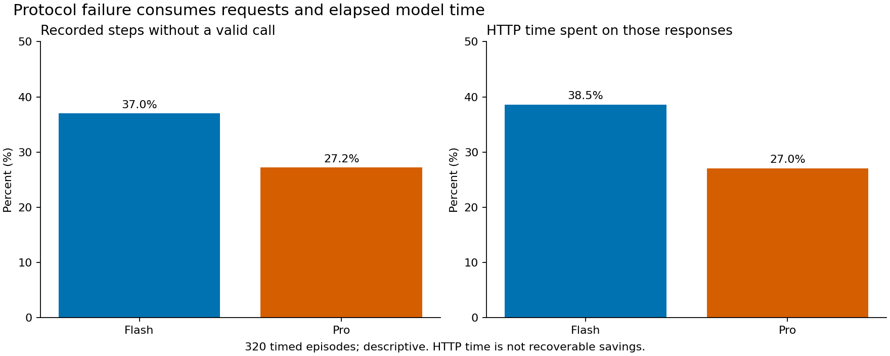
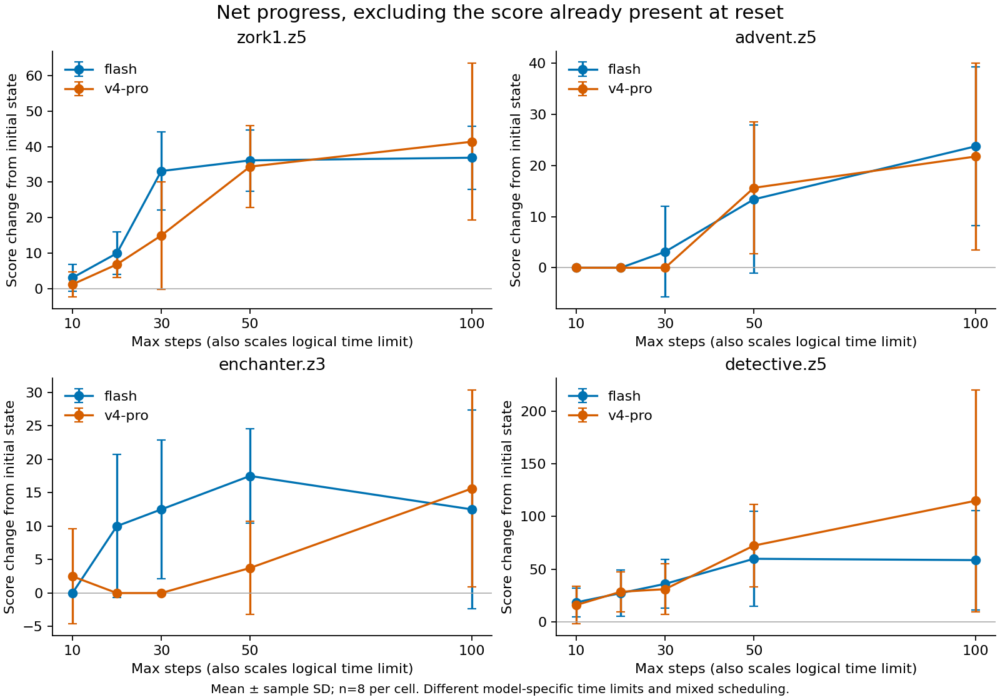

# Timely：逐轮轨迹分析

日期：2026-10-07。范围：昨天封存的 384 条四游戏轨迹；本次只离线分析，没有新增模型实验。结论是描述性的：**相当多开销消耗在没有有效工具调用的响应上；修复调用格式与推进任务需要分开评价。** 目前不能据此证明经验记忆有效，也不能证明较快模型在共同实际时限内更强。

## 数据与口径

- 64 条校准、320 条正式计时轨迹；正式矩阵为 4 游戏 × 2 模型 × 5 档预算 × 8 次重复。模型使用接口标识 `deepseek-flash` / `deepseek-v4-pro`，不由名称推断参数量。
- 对齐 12,521 个 API 响应、12,494 个官方记录步骤和环境操作。27 个 conclusion 响应在官方记录 step 前结束，保留为独立响应，不能当缺失步骤。
- 一次 iteration 指一个模型响应。工具解析、工具分派和环境操作单列；缺失 action 的 8 次调用被分派但未进入环境。官方循环每轮只执行首个解析调用。
- 每轮分数从环境 before/after 获取。无环境操作时延续最近值，并标记为 carried，不伪装成新观测。Advent 开局已有 36 分，Detective 已有 10 分；净进展为末分减开局分。
- 分类优先级为 conclusion、no_tool、参数错误、加分、扣分、查询、结束、重复反馈、其他动作。零即时奖励不能说明动作无用，反馈文本重复不能说明完整状态相同。
- HTTP 时长是模型请求的 monotonic 耗时；不含工具、编排时间。各独立 episode 的耗时加总不是整批并行墙钟时间。逻辑工具延迟与真实工具耗时分别保留。
- 原有分模型校准、最大步数、前 256 条 chunk-six / 后 128 条持续补位、19 条时钟标记均未改动；不能把预算横轴解释成相同实际秒数。完整复现边界见[原结果报告](timely-official-results.md)。

## 主要发现

以下只用 320 条正式计时轨迹。无有效调用比例的分母是官方 recorded steps，排除 conclusion；响应总数另列，避免混淆。

| 指标 | Flash | Pro |
| --- | ---: | ---: |
| 模型响应 / 官方步骤 | 5,263 / 5,261 | 5,412 / 5,392 |
| 无有效工具调用步骤 | 1,946（37.0%） | 1,466（27.2%） |
| 上述响应占模型 HTTP 时间 | 38.5% | 27.0% |
| 提出多个调用的响应 | 497 | 25 |
| 解析成功但未执行的后续调用 | 1,046 | 37 |
| 连续 no_tool 错误段 | 1,155 | 536 |
| 观测窗口内错误段后恢复有效调用 / 全部错误段 | 1,118 / 1,155（96.8%） | 490 / 536（91.4%） |
| 运行结束时仍未闭合的错误段 | 35 | 26 |
| 已闭合错误段中的恢复比例 | 1,118 / 1,120（99.8%） | 490 / 510（96.1%） |
| 恢复后的第一步立即加分 | 63 / 1,118（5.6%） | 20 / 490（4.1%） |
| 最终净增为零的轨迹 | 56 / 160 | 81 / 160 |
| 出现过扣分的轨迹 | 10 / 160 | 6 / 160 |

1. **协议适配是实际瓶颈。** 3,412 个 timed no_tool 响应中，仅 13 个以 length 结束，因此不能把当前大量无有效调用主要归因于输出 token 上限。标签不闭合、不同调用方言是描述性标记，不能自动当作唯一根因。
2. **恢复调用不等于解决任务。** 很多错误段很快恢复，但恢复后的第一步很少立即得分。游戏奖励稀疏，不能反过来断言恢复无用；下一步应验证后续子目标完成，而不只统计“下一轮不报错”。
3. **“多想、多做”有时没有改变得分。** 137/320（42.8%）末分等于开局分，其中仍可能有未计分探索。16/320（5.0%）出现扣分，只有 1 条最终净增为负；“长任务普遍越做越坏”不是本批主要信号。
4. **调用数必须区分生成与执行。** Flash 的 1,046 个未执行后续调用中，429 个来自 episode-322，存在明显集中现象。不能把它们计作有效迭代，也不能把潜在执行它们的效果或节省时间当作已知。

上述时间占比是观察到的成本，**不是可回收的提速比例**。改变格式、合并步骤或注入记忆会改变后续轨迹，必须新实验验证。

运行结束时未闭合的错误段视为后续未观测，不能声称它们永远无法恢复；表中同时提供全部段与已闭合段的分母。闭合但未恢复的段在本批均接 conclusion，表示观察到模型结束而没有下一次有效工具调用。所有分派请求都有完成事件，本批无失败/超时/重试事件被排除。作为奖励稀疏性的参照，所有有工具分派的步骤中，加分比例为 Flash 287/3,315（8.7%）、Pro 307/3,926（7.8%）；它与错误后恢复子集不是随机对照，不据此推断修复导致收益降低。

## 逐轮示例

这些是事后选取的诊断案例，不是随机代表样本；episode-234 延续此前已展示的随机案例。

| 轨迹 | 关键过程 | 可以说明什么 |
| --- | --- | --- |
| episode-234，Advent / Pro / 30 | 开局 36，最终仍 36；2 次 no_tool，查询 7 次 | 有工具调用不代表发生得分进展；此前的 36 分来自开局 |
| episode-129，Zork / Flash / 50 | 第 7 轮 0→5，第 17 轮 5→15，第 28 轮 15→40，第 32 轮攻击后 40→30 | 能定位具体回退；不能仅凭一次扣分就学到“永不攻击” |
| episode-167，Detective / Pro / 100 | 从 10 到 350，环境确认胜利 | 存在多步推进至真实成功的轨迹，区别于模型自称完成 |
| episode-369，Advent / Pro / 100 | 100/100 响应没有有效调用，36→36 | 协议失败可以贯穿整条任务；是极端诊断例，不是均值 |
| episode-322，Advent / Flash / 50 | 429 个解析出的后续调用未执行，36→36 | 模型生成计划与实际执行之间存在显著差距 |
| episode-365，Advent / Pro / 100 | 21 次相邻动作反馈重复；第 47 轮 +25，第 53 轮 +7，末分 68 | 重复观察与后续成功可以共存，不能机械删除所有重复步骤 |

交互查看器支持选择全部 384 条轨迹、逐轮动作、分数前后、请求耗时和工具反馈。完整版本只在本地 `.local/timely-iteration-analysis-20261007/trace-explorer.html`；会话内提供六例的摘要版本。公开衍生数据含最多 160 字符的模型动作参数，不含完整模型响应或游戏反馈正文。

## 净进展与此前图的关系

横轴是原实验最大步数，也同时作为逻辑时限的倍率，**不是共同墙钟 deadline**；均值 ± 样本标准差，每格 n=8。不同预算是不同独立运行，并非同一条轨迹的截取，不用跨预算均值下降证明单任务退化。各游戏原始分数不混合平均。

本图使用环境 signed score，原官方字段保持原样。Zork Pro/100 均值因此为 41.375，原报告官方 raw 字段为 42.625；来自原已披露的单条分差，不是重跑或覆盖旧结果。

## 能导出什么经验

可以从协议错误段提取可验证的局部规则候选；可以从成功轨迹定位子目标与前置条件；扣分和重复反馈可作为人工复核入口。**当前没有完整中间状态快照，也没有未执行动作的反事实结果，不能证明删掉某一步仍然成功。** 同一游戏重复八次也不是八种新任务迁移。

昨天[编程实验](coding-deadline-results.md)同样提示不要过度归因：Flash 的可交付首稿之后未见额外通过收益，Pro 的增益主要是从没有可交付候选到产生候选；/99 的参考标签还有语义问题。它们不足以充当“修复技能已有效”的证据。

建议的训练免费方案、对照和候选研究方向见[经验学习方案](training-free-experience-plan.md)；任务拓展见[多类型 benchmark 调研](multitask-benchmarks-20261007.md)。

## 复现与证据

- 脚本：[分析](../../research/analyze_timely_iterations.py)、[绘图](../../research/visualize_timely_iterations.py)，命令见[用法](../../research/README.md#offline-timely-iteration-analysis)。
- [汇总](../../research/results/timely-iterations/summary.json)、[每条运行](../../research/results/timely-iterations/runs.json)、[逐轮衍生指标](../../research/results/timely-iterations/iterations.jsonl)、[输入哈希](../../research/results/timely-iterations/provenance.json)。
- 384 个唯一计划成员、响应全文与 step 精确对齐、环境操作顺序、无未观测分数变化、终分一致、no_tool 总数、40 个 timed cell 各 n=8 均通过。净分守恒只是内部一致性检查，不是独立真值。原始证据只读；检查全部请求事件和工具名，拒绝静默排除未知类别。
- [验证记录](../../research/results/timely-iterations/validation.json)包含源码/模板/图表哈希及浏览器检查；[审查处置](../reviews/2026-10-07-timely-iterations.md)记录实际 Claude CLI 结果和范围。
- 本地分析与绘图不调用模型。Claude 代码审查是独立工作流，不计作零实验费用的 API 试验。
