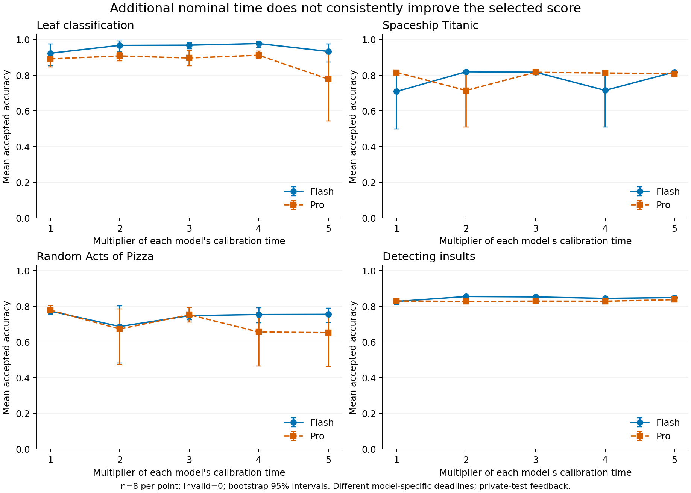
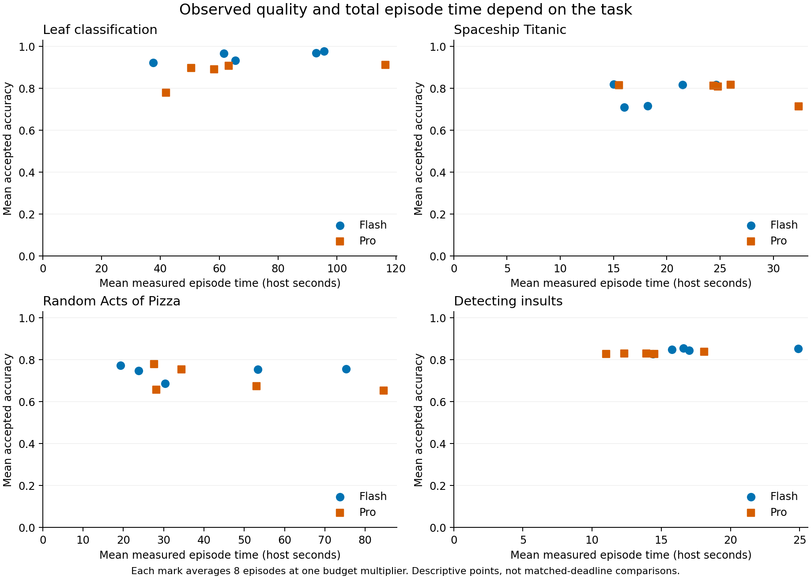
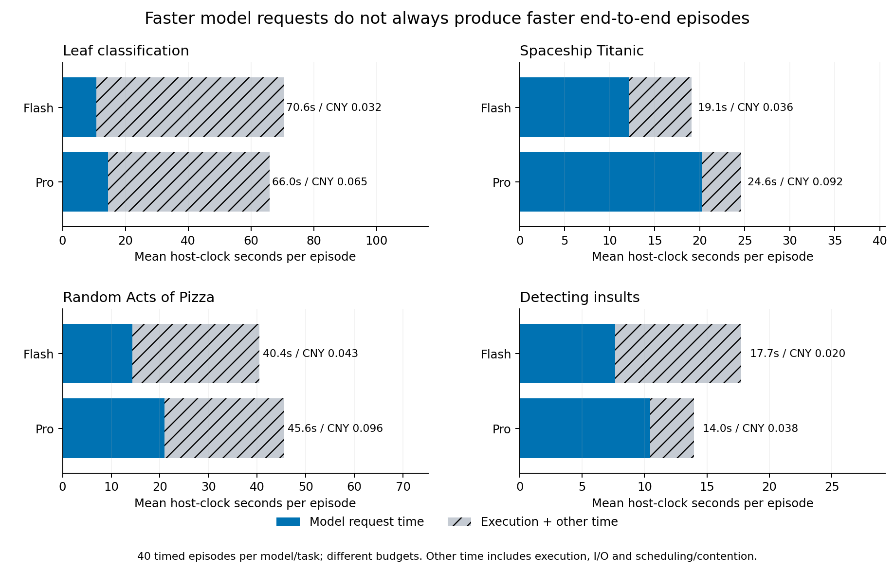
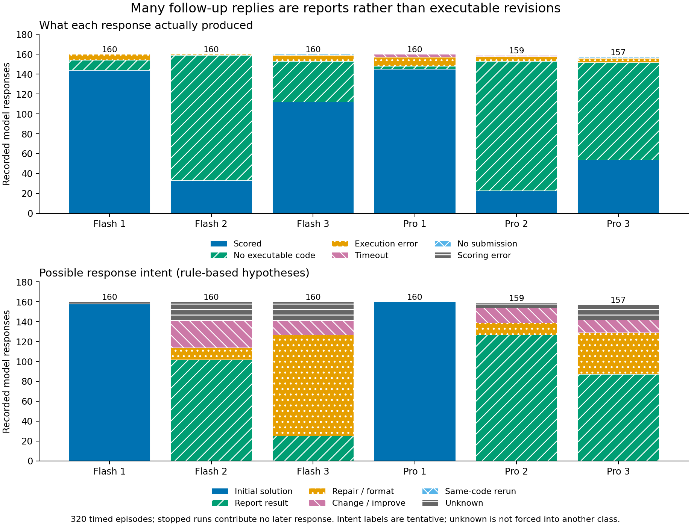
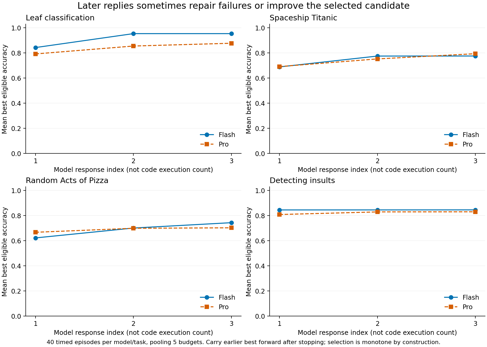

# Timely Agentic ML：结果与阶段轨迹分析

分析对象是纠正后的 **384 条轨迹（64 校准 + 320 限时）**，包含 1034 次模型回复、616 次代码执行。373 条轨迹有有效提交；故障首批未混入。本次只读取已完成的实验，没有新增 Provider 请求、重跑或替换评分。执行和账务见[完成记录](timely-ml-completion.md)。

## 1. `no valid submission` 是什么

它表示整条轨迹没有被原评测器接受的可评分提交，并不等于“模型做出了预测，但准确率很低”。限时阶段只从不晚于 **1.5 × 名义预算**完成的有效候选中取最高私有测试 accuracy；没有候选时记 0，保留在全部计划样本的分母中。

本批 11 条无效轨迹中，**8 条有代码或数据处理错误，1 条始终没有可解析代码，1 条没有生成提交文件，1 条执行超时**。没有仅因有效候选晚于接受期限而失败的轨迹。分类是按整条轨迹中出现的阻断归纳，多个错误可以共存。

汇总的主类别按“只在截止后有效 → 执行超时 → 非零退出 → 全程无代码 → 评分失败 → 缺提交文件”优先级单选；逐轮结果仍保留其他错误。

| 轨迹 | 模型 / 任务 / 条件 | 观察到的阻断 |
| --- | --- | --- |
| ml-051 | Flash / Spaceship / 校准 | 两次执行均缺少 `Transported` 列 |
| ml-062 | Pro / Pizza / 校准 | 两次回复均未被原解析器提取出可执行代码 |
| ml-063 | Flash / Insults / 校准 | 首轮无代码；后续进程正常退出但没有提交文件 |
| ml-157 | Flash / Pizza / ×2 | Python 中混入工具标签导致语法错误；后两轮无可执行代码 |
| ml-174 | Pro / Pizza / ×4 | 数值变换产生 NaN，三次训练均失败 |
| ml-196 | Pro / Spaceship / ×2 | 训练与预测特征数不一致，三次均失败 |
| ml-218 | Pro / Leaf / ×5 | 分层验证集大小 90，小于类别数 99，三次均失败 |
| ml-238 | Pro / Pizza / ×2 | 代码执行超时，没有可评分候选 |
| ml-302 | Pro / Pizza / ×5 | 两次使用不支持的 `verbose_eval` 参数；后续仍无提交文件 |
| ml-347 | Flash / Spaceship / ×1 | 两次特征数不一致；后续回退方案遇到 NaN |
| ml-371 | Flash / Spaceship / ×4 | 特征 dtype 不支持；后续未写出文件，最后无代码 |

例如 `ml-174`：第 1 轮构建 TF-IDF、数值特征和逻辑回归方案，执行失败；第 2–3 轮合并为“尝试修复失败”。模型先怀疑文件保存，再怀疑交叉验证兼容性，但执行日志中的阻断一直是 NaN。**第 2 轮虽声称修复，提取出的代码与第一次完全相同；第 3 轮才改动代码。** 可见“想修复”“改了代码”“修好了”需要分开记录。评测器通常只反馈退出码，没有把本地保存的 stderr 细节交给模型，因此不能假设模型看到了 NaN 堆栈。

## 2. 各任务的质量、时间和费用

下表每格为 **40 条限时轨迹**的平均，合并 5 个预算倍数，每倍数 8 次。质量采用原私有测试 accuracy，无效轨迹记 0；时间是 Windows 主机单调时钟记录的完整 episode 时间；费用是峰值价格估算，不是账单。

| 任务 | Flash / Pro accuracy | Flash / Pro 有效提交 | Flash / Pro 秒 | Flash / Pro 元 |
| --- | ---: | ---: | ---: | ---: |
| Leaf | 95.38% / 87.73% | 40/40 / 39/40 | 70.60 / 66.02 | 0.032 / 0.065 |
| Spaceship | 77.58% / 79.40% | 38/40 / 39/40 | 19.08 / 24.61 | 0.036 / 0.092 |
| Pizza | 74.41% / 70.33% | 39/40 / 37/40 | 40.44 / 45.58 | 0.043 / 0.096 |
| Insults | 84.60% / 83.08% | 40/40 / 40/40 | 17.74 / 13.97 | 0.020 / 0.038 |

这是本配置下的描述性差异，不能直接得出统一时间预算下的模型排名。作为辅助诊断，仅看有效轨迹时 Spaceship 为 Flash 81.66% / Pro 81.43%，Pizza 为 76.32% / 76.04%；这两题的总体差异与提交可靠性关系很大。有效子集存在筛选偏差，因此它不能替代含失败的主指标。

评分语义核对了冻结上游 `src/timely_eval/ml_metrics.py`：Leaf 对类别列取 argmax 计算 accuracy；Spaceship、Pizza 和 Insults 允许 [0,1] 概率，按 `>=0.5` 转为标签计算 accuracy。原评分器还返回 log loss，但最终择优使用 accuracy，**没有按 ROC AUC 选候选**。Pizza/Insults 的提示和部分模型自述提到 AUC，这种目标与实际择优指标不一致是解释策略变化的限制，未在本批事后修正。

每点 n=8；误差线为 2000 次重采样的百分位 bootstrap 95% 区间，固定随机种子 20261007；采用 nearest-rank 百分位（零基索引 49/1949）。小样本区间可能偏窄，只描述这四个固定任务内的重复波动，不能代表跨任务泛化。增加名义预算没有带来稳定单调的质量提升；各预算条件是不同的随机生成轨迹，且原循环最多只有三次模型回复。

横轴是实际平均耗时，不是规定的共同 deadline；每个点是一个任务、模型和预算倍数的均值。未拟合连续曲线，也未据此计算模型切换边界。

Flash 在四题中的累计模型请求时间均较低，但在 Leaf 和 Insults 的完整任务时间反而较高。请求之外的部分包括代码执行、启动、评分和 I/O，不能全部称为训练时间，也不能把 WSL guest 的执行计时直接与 Windows 时间相减。这支持继续分析工具与执行开销，但尚未证明具体因果机制。

具体计时边界：`timely_ml.py` 在调用 `generate_response` 前开始计时，位于该函数内部信号量获取之前；每条 episode 的信号量独立、调用串行，本批不存在跨 episode 的此信号量排队。请求区间还包含 SDK、准入/记账、网络和 Provider 服务开销，并非纯生成时间。episode 计时不包含从批次队列等待 worker 的时间；请求外的时间还可能受时钟桥接、调度和两个 worker 的资源争用影响，尚未通过匹配负载实验分离。

## 3. 将连续 iteration 合并成阶段

iteration 定义为一次模型回复，**无代码的回复也计数**。展示层按连续同类意图合并，不跨轨迹；修复/补格式可以在失败仍持续时合并，出现可评分结果后再分段。阶段只代表粗粒度标签连续，不保证内部是同一个 bug 或完全相同的目标。

1034 轮合为 **928 个阶段**，其中 **106 个阶段含多轮**。原协议限时最多三轮、校准最多两轮，因此不强行制造很长的阶段。

| 可能意图 | 回复数 | 阶段数 | 主要证据 |
| --- | ---: | ---: | --- |
| 构建初始方案 | 381 | 381 | 首轮候选代码，或首轮明确陈述构建目标 |
| 解释或报告结果 | 341 | 253 | 汇报结果的文字，没有可执行代码 |
| 补充可执行代码 | 154 | 153 | 明确说重新提供代码，或无代码反馈后提供代码 |
| 尝试修复失败 | 27 | 21 | 明确修复措辞，或失败反馈后改动代码 |
| 尝试提高质量 | 51 | 50 | 回复明确陈述质量改进目标 |
| 建模器组合变化 | 17 | 16 | 识别到建模器构造函数集合变化，包括新增集成组件 |
| 尝试降低耗时 | 1 | 1 | 明确陈述更快的方案 |
| unknown | 62 | 53 | 当前规则无法确定或目标冲突 |

两列不能逐项相减解释合并数：少数补格式与修复阶段合并后归入“修复”。另外有 21 次实际代码完全重复，这是独立的观察字段；它不一定是主要意图，因为回复可以声称要修复或补格式。

表格是**规则命中数，不是意图的真实占比**。质量改进的表达未被穷举，可能落入“建模器组合变化”或 unknown。“重复相同代码”主意图在本批为零，其图例保留作为预定义类别；实际重复次数以上述独立字段为准。

单轮标签读取当前回复、当前/之前代码，以及由执行记录归纳的前序反馈等价类别（无代码、失败、已评分），不读取当前执行结果、之后回复或最终得分来推断本轮意图。**阶段边界则会使用执行结果，属于事后展示单位，不能整体作为在线路由特征。** `medium` 表示自述或较直接结构线索，`low` 表示上下文推测，均不是统计概率。**这是规则辅助标注，并非模型真实心理状态或已验证的分类器。** 抽查当前版本分层采样的 22 条回复，只作合理性检查；没有逐条人工裁决或测量准确率。`unknown` 也包括规则未覆盖的明确表达，人工阅读后仍可修改。

本地交互页由 `research/visualize_timely_ml.py` 生成到 `.local/timely-ml-analysis-preview/explorer.html`，支持任务、模型、校准/限时、有效性、意图筛选，以及展开逐轮证据。公开数据保存意图、判断依据、实际代码变化、结果、时间和费用，原文和代码仍保存在忽略目录。

全部回复中 **418/1034（40.4%）没有可执行代码**，其中很多是在汇报已有结果，不能全部解释成能力失败。限时轨迹中出现 121 次“报告结果 → 补代码/重复”标签转移（Flash 87、Pro 34），表明需要检查模型停止意图与评测循环是否匹配。

例如 Pro 的 `ml-248`：第 1 轮有效提交，accuracy 0.8342，累计 7.33 秒；第 2 轮汇报结果，没有代码；评测器要求补代码后，第 3 轮重复第一次代码，accuracy 仍是 0.8342，累计 14.28 秒。这是一个具体的协议往返案例，不能把它算成一次质量改进。

## 4. 迭代确实发生了什么

320 条限时轨迹中，**62 条后续接受分数高于首轮**；其中 23 条是首轮没有符合接受条件的候选，后来获得有效候选（Flash 13、Pro 10）。并非每次改动都有增益。图中提前停止的轨迹保留之前最好结果；best-so-far 曲线按定义不会下降，不能把这个形状当作反馈有效的因果证据。

23 条“恢复”仅指评分状态恢复，未证明新程序重新写出了预测：执行记录没有逐轮提交 hash/mtime，无法排除前轮写出文件后崩溃、后轮复用旧文件通过的情形。因此不能直接称为 23 次成功修复代码。

Pizza 的首轮均分 Flash 62.28% / Pro 66.76%，最终为 74.41% / 70.33%，与“后续迭代改变相对表现”的假设相容。但这里混合了格式恢复、运行恢复、候选变化和私有测试择优，而且预算不同，尚不能说更快的模型因多迭代而反超。

值得后续验证的三个问题：

1. **有效迭代密度**：剔除纯报告、格式往返、重复执行后，单位实际时间内有多少次带来新有效候选的迭代？终止协议与模型能力分别贡献多少？
2. **反馈是否足以定位错误**：28 次通用退出码反馈之后仍有下一次回复。详细错误反馈是否减少错误归因和无效修复，需要同状态受控比较。
3. **生成速度与执行代价**：模型回复快，生成的 ML 程序是否更慢？能否根据早期代码/执行 trace 判断下轮继续、简化方案或换模型的收益？本批只提供候选信号，尚无新颖性或方法有效性结论。

## 5. 解释边界与验证

- 模型专属校准时间不同，例如 Leaf 为 Flash 57.63 / Pro 85.61 秒，Pizza 为 62.83 / 39.33 秒。相同倍数不等于相同 deadline；这些模型的参数量也未由本实验确认。
- 原循环把私有测试分数反馈给模型，并据此择优，不是 untouched held-out 泛化评估。数据划分为重建版本，API 模型也是替代模型，不能声称逐字复现论文结果。
- 同一轨迹的工作区被复用，后续执行前不清除旧提交。本报告沿用原评分器“接受了候选”的口径，不能假定每次评分都证明代码新写出了一份文件；没有事后重评改分。
- 原协议允许 1.5 倍接受期限。对既有轨迹事后改用 1.0 倍筛选，会降低 8 条限时轨迹的分数，其中 5 条失去正分；这只是敏感性检查，并非真正严格 deadline 的重跑结果。
- 单轮最多 2048 输出 token，152 次回复 `finish_reason=length`。长度结束不自动等于无效提交，不能直接将全部失败归因于截断。
- 分析逐一对齐 1034 次 API 回复、原解析器提取代码与 616 次执行，复算全部 384 条官方分数/有效性；独立核验 48 个 n=8 单元、阶段覆盖唯一性和精确费用，第二次离线构建表格字节一致，冻结输入哈希未变。没有执行模型生成的代码。
- `analyze_timely_ml.py` 完成回复/执行对齐及依据已记录候选分数重建最终选择，并非从提交文件重跑评分器。`verify_timely_ml_analysis.py` 以冻结计划独立检查分组身份、均分、有效数、费用和覆盖，调用 analyzer 在新临时目录重建，再比较全部表格；两者合起来复现上述核验。公开计划行仅含 model、multiplier、phase、repeat、run_id、task，无 endpoint、路径或凭证。Git 属性保留生成文件字节，确定性字节检查目前仅保证同一平台，未承诺 Windows/Linux 输出字节相同。
- 五张图均导出 PNG/SVG/PDF，实际绘图环境 Matplotlib 3.10.8；图表/模板/数据哈希见 [manifest](../../research/figures/timely-ml/manifest.json)。表格、来源哈希和验证见 [analysis outputs](../../research/results/timely-ml-analysis/summary.json)、[provenance](../../research/results/timely-ml-analysis/provenance.json)、[validation](../../research/results/timely-ml-analysis/validation.json)。

实际 Claude CLI 审查与最终处置见[审查记录](../reviews/2026-10-07-timely-ml-analysis.md)。本批估算费用保持 19.111148528 元，ML 含隔离旧批合计 24.181660992/50 元；本轮分析新增实验费用为 0，Claude 审查另计。
